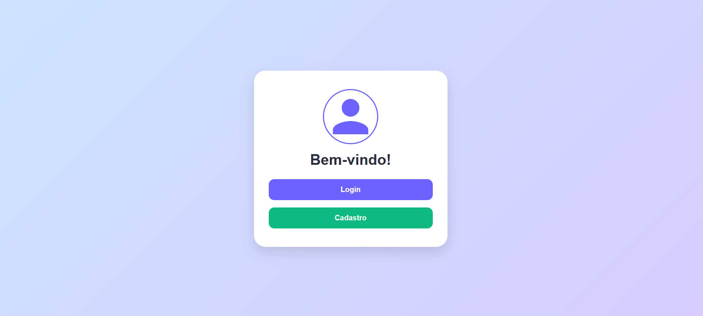
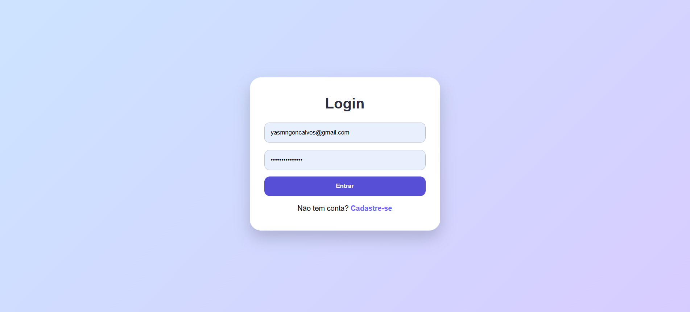

# 📝 Prova Prática – Sistema de Cadastro e Login (Laravel)

## 1️⃣ O que é um framework

Um **framework** é um conjunto de ferramentas, bibliotecas e estruturas pré-prontas que ajudam o desenvolvedor a criar aplicações de forma mais rápida e organizada.
Ele fornece regras e padrões que facilitam a escrita de código, evitando que tenhamos que começar tudo do zero.

Por exemplo, o **Laravel** é um framework PHP que já traz funcionalidades prontas como:

* Rotas e controllers
* Templates (Blade)
* Conexão com banco de dados
* Autenticação
  Isso permite focar na lógica da aplicação e no design, ao invés de reinventar a roda.

---

## 2️⃣ Sobre o projeto

**Nome do projeto:** LearnUp – Sistema de Cadastro e Login de Usuário

**Objetivo:**
Criar um fluxo completo de autenticação e gerenciamento de usuários, incluindo telas de cadastro, login, home e edição de perfil, com validação de dados e sistema de logout.

**Funcionalidades implementadas:**

* **Home:** Tela de boas-vindas com botões de Login e Cadastro
* **Cadastro:** Formulário para criar novo usuário (nome, email e senha) com validação
* **Login:** Formulário para autenticar usuário
* **Perfil/Editar:** Tela disponível somente para usuários logados, permite editar nome e email
* **Logout:** Botão para sair da aplicação
* **Design moderno:** Cards com sombra, bordas arredondadas, botões coloridos, avatares/ícones SVG
* **Validações:** Inputs obrigatórios, mensagens de erro/sucesso

**Tecnologias utilizadas:**

* Backend: PHP + Laravel 12
* Frontend: Blade templates + CSS personalizado (cards, botões, layout flexível)
* Controle de autenticação: Middleware do Laravel para proteger a tela de edição

---

## 3️⃣ Estrutura das telas

| Tela     | Funcionalidade                                            |
| -------- | --------------------------------------------------------- |
| Home     | Boas-vindas, botões Login e Cadastro, ícone centralizado  |
| Login    | Autenticação do usuário                                   |
| Cadastro | Criação de usuário com validação                          |
| Perfil   | Edição de nome e email, avatar, botão de logout           |
| Layout   | Cards centralizados, inputs estilizados, botões com hover |

---

## 4️⃣ Como executar o projeto

1. Clonar o repositório:

```bash
git clone <URL_DO_PROJETO>
```

2. Instalar dependências:

```bash
composer install
```

3. Criar arquivo `.env` e configurar banco de dados
4. Rodar as migrations:

```bash
php artisan migrate
```

5. Iniciar o servidor:

```bash
php artisan serve
```

Acesse o sistema em: `http://127.0.0.1:8000`

---

## 5️⃣ Demonstração (vídeo)

> Adicione aqui o link do vídeo mostrando o fluxo completo: home, cadastro, login e perfil.

---

## 6️⃣ Imagens (opcional)

Você pode adicionar **screenshots ou mockups** do sistema, por exemplo:

**Home**


**Cadastro**


**Login**


**Perfil**


